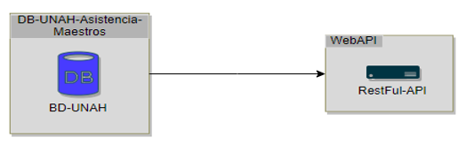
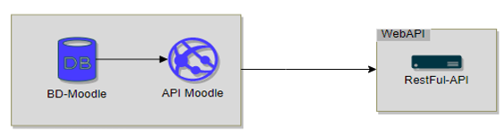
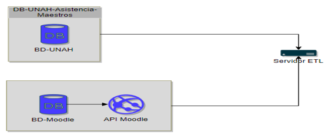
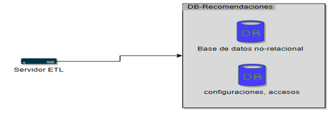
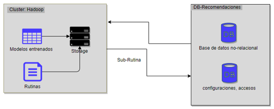
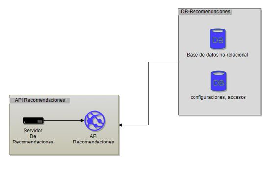
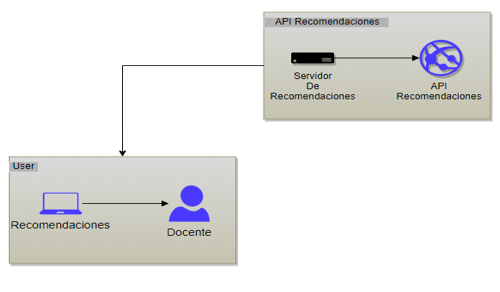
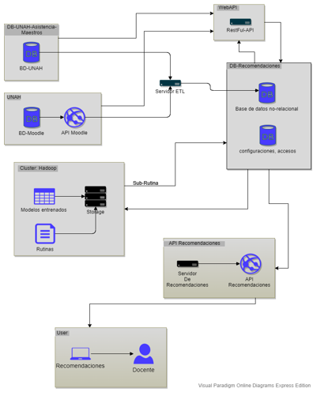

```{r setup, include=FALSE}
knitr::opts_chunk$set(echo = TRUE)
library(dplyr)
library(ggplot2)
library(caret)
```

## INTRODUCCIÓN

En el análisis presentado posteriormente se expone la información recolectada en la encuesta realizada a los estudiantes de la carrera de ingeniería en sistemas de la Universidad Nacional Autónoma de Honduras, en el presente estudio se realiza la limpieza de datos correspondiente, un análisis descriptivo de los datos y se indican las correlaciones entre variables categóricas de la investigación, aceptando o rechazando los resultados en función de la hipótesis nula mediante las pruebas de Ch² así como las conclusiones en relación con los datos obtenidos; asimismo se presenta una regresión logística mediante la variable de respuesta y el coeficiente de importancia de las variables de acompañamiento y finalmente se expone una solución tecnológica mediante la utilización de plataformas Learning Management System. 


## VARIABLES CAPTURADAS

Se recabaron las siguientes observaciones y columnas en la encuesta:

```{r variables capturadas, echo=FALSE}

survey<- read.csv("tesis_paper.csv",header = T,sep = ";",encoding = "UTF-8",na.strings = c(""))


for (mynames in names(survey)) {
    
    if(mynames!="Horas_.diarias_.estudio"){
        survey[,mynames] <- as.factor(survey[,mynames])
    }
}

str(survey)

```


Se obtuvieron `r nrow(survey)` observaciones y `r length(names(survey))` columnas diseñadas en función de las siguientes categorías de variables:

- Demográficas
- Acceso a internet / computadora
- Registro
- Matricula
- Hábitos del estudiante
- Interrupción del proceso académico
- Motivación del estudiante
- Sobrepoblacion - estudiante
- Sobrepoblacion - docente
- Inversión económica de la UNAH
- Plataformas virtuales

A continuación, podemos ver un resumen de cada categoría:

```{r resumen_columnas}
summary(survey)
```


## VARIABLES DESCARTADAS

Fueron descartadas las siguientes variables porque luego de su análisis se consideró que no se extrae información que nos ayude a concluir algo en nuestra investigación:

Columna | Pregunta de Referencia
-- | --
anio_estudio | ¿En qué año académico te encuentras?
clases_matriculadas | ¿Cuántas clases matriculaste este periodo?
contratacion | ¿Consideras que la UNAH debe contratar más docentes para la facultad de ingeniería en sistemas?
inversion_recursos | ¿Consideras que la UNAH debe poner más recursos materiales a disposición en facultad de ingeniería en sistemas?


## TRATAMIENTO DE VALORES ATÍPICOS

Al analizar la información podemos observar valores atípicos en las columnas de *Edad* y *lms_utiliza*, seguidamente se explica cada uno de sus tratamientos:

### Valor atípico en la columna edad:

Gráfico boxplot:

```{r boxplot atípico de edad}
df_info  <- as.data.frame(prop.table(table(survey$Edad))) %>% arrange(-Freq)
boxplot(df_info$Freq)
qqnorm(df_info$Freq)

```


Al examinar la frecuencia de la información se obtuvieron los siguientes datos:

```{r freq_edad, echo=FALSE}
df_info
```


Podemos ver que se obtuvo tan solo 1 respuesta para el rango de edad *33-37* y *>38*, por lo cual agruparemos estas 2 respuestas en el rango **">33"**, realizando la siguiente transformación:


```{r transformación edad, echo=FALSE}

  df_info[df_info$Var1 %in% c(">38","33-37"), "categoria"] <- ">33"
  df_info[df_info$Var1 %in% c("23-27"), "categoria"] <- "23-27"
  df_info[df_info$Var1 %in% c("18-22"), "categoria"] <- "18-22"
  df_info[df_info$Var1 %in% c("28-32"), "categoria"] <- "28-32"

  df_info
```


Seguidamente añadimos esta transformación a la encuesta original:

```{r edad encuesta, echo=FALSE}

  df_info <- df_info %>% select(Var1, categoria)
  survey$Edad <- as.factor(survey$Edad)

  survey<-left_join(survey,df_info,by=c("Edad"="Var1"))
  survey<- survey[,!(names(survey) %in% c("Edad"))] 
  names(survey)[length(names(survey))] <-"Edad"
  survey$Edad <- as.factor(survey$Edad)
  summary(survey$Edad)

```

Observamos que al realizar las transformaciones la columna *Edad* ya no retorna valores atípicos por lo tanto la transformación fue acertada.

```{r limpieza edad}

  df_trans <- as.data.frame(prop.table(table(survey$Edad))) %>% arrange(-Freq)
  boxplot(df_trans$Freq)
  qqnorm(df_trans$Freq)

```


### Valor atípico en la columna lms_utiliza


Los datos presentan un valor atípico en respuesta a la pregunta: ¿Cuál de los siguientes LMS has utilizado? , según la variable *lms_utiliza*

```{r atipico LMS utiliza}
df_lms  <- as.data.frame(prop.table(table(survey$lms_.utiliza))) %>% arrange(-Freq)
boxplot(df_lms$Freq)
qqnorm(df_lms$Freq)
```


Como podemos apreciar en el gráfico de normalidad **qqnorm** los datos no presentan una distribución normal pues se encuentran muy dispersos y al examinar la frecuencia de la información se obtuvo la siguiente información:

```{r frecuencia LMS utiliza, echo=FALSE}
df_lms
```


Al analizar la columna **lms_utiliza** se notó  que presentaba valores atípicos y no representaba en esencia lo que se quería dar a conocer en la investigación, pues el objetivo era saber si el estudiante conocía la herramienta Moodle o no.

Con respecto a la información recolectada se decidió transformar las respuestas de la columna lms_utiliza a expresiones referentes a si conoce moodle o no cambiando el nombre de la columna de lms_utiliza a **conoce_moodle**.

```{r transformacion_lms_utiliza, echo=FALSE}

  df_lms[df_lms$Var1 %in% c("Moodle","Moodle;Otras","Moodle;Wordpress","Moodle;Wordpress;Otras","Moodle;Canvas LMS;Wordpress","Moodle;Canvas LMS","Moodle;Canvas LMS;Otras") , "categoria" ] <- "Si"
  df_lms[df_lms$Var1 %in% c("Otras","Wordpress","Canvas LMS","Canvas LMS;Wordpress","Canvas LMS;Wordpress;Otras"), "categoria"  ] <- "No"

  df_lms<-df_lms%>%select(Var1,categoria)

  survey<-left_join(survey,df_lms,by=c("lms_.utiliza"="Var1"))

  survey<- survey[,!(names(survey) %in% c("lms_.utiliza"))] 

  names(survey)[length(names(survey))] <-"conoce_moodle"

  survey$conoce_moodle <-  as.factor(survey$conoce_moodle) 

  summary(survey$conoce_moodle)

```

Como podemos notar se resumieron los datos de la forma siguiente:

**Si**, para respuestas en las que el encuestado afirmaba haber utilizado Moodle

**No**, para respuestas en las que el encuestado no conocía Moodle

```{r limpieza_conoce moodle}

df_trans_lms <- as.data.frame(prop.table(table(survey$conoce_moodle))) %>% arrange(-Freq)
boxplot(df_trans_lms$Freq)
qqnorm(df_trans_lms$Freq)
```


Después de la transformación podemos apreciar que según los gráficos no se muestran datos atípicos.


## TRATAMIENTO DE VALORES NA


Al realizar el análisis de los datos encontramos las siguientes columnas con valores NA:

```{r valores_na, echo=FALSE}

na.survey <- c()	 #creamos el vector para los valores NA

for (myname in names(survey)){
en<-as.data.frame(prop.table(table(is.na(survey[,myname]))))
  	operacion <- en %>% filter(Var1==TRUE) %>% select(Freq)
  	length(operacion$Freq)
  	df_temp <- data.frame(
    	column.name=c(myname),
    	na.percentage=ifelse(length(operacion$Freq)==0,0,operacion$Freq[1])
  )
  na.survey <- rbind(na.survey,df_temp)
}
na.survey %>% arrange(-na.percentage) %>% filter(na.percentage > 0)
```

Realizaremos el tratamiento correspondiente para los valores NA obtenidos de las variables:

- Estimaci.n_.horas_.libres
- Estimaci.n_.lms
- conoce_moodle
- Calidad_.conexi.n


### Imputación calidad conexión

```{r conexión permanente }
summary(survey$Conexi.n_.permanente)
```

Hubieron 24 respuestas de personas que no tienen una conexión permanente a internet, por lo tato se esperan la misma cantidad de respuestas NA en la variable **Calidad_.conexi.n**

```{r calidad conexión}
summary(survey$Calidad_.conexi.n)
```

Respecto a la variable Calidad_.conexi.n imputamos los valores NA con valores **“NO”** pues eran dependientes de la variable  **Conexi.n_.permanente** respectivamente y al responder esta con un NO se imputan las respuestas a las demás variables con un NO de la siguiente forma:

```{r imputacion de calidad de conexion, echo=FALSE}
 
survey[is.na(survey$Calidad_.conexi.n), "Calidad_.conexi.n"] <-"No"

summary(survey$Calidad_.conexi.n)
```


### Imputacion conoce Moodle

```{r conoce_moodle}
summary(survey$conoce_moodle)
```

Reemplazaremos las incidencias NA de la variable conoce_moodle por **"NO"** debido a que no se contesto la variable de dpendencia *Uso_lms*.

```{r , echo=FALSE}

survey[is.na(survey$conoce_moodle), "conoce_moodle"] <- "No" ## cambiando apariciones NA por NO

summary(survey$conoce_moodle)
```


### Tratamiento de estimación de horas libres


```{r horas_libres}
summary(survey$Horas_.libres)
```
Hubieron 48 respuestas de personas afirman que no tienen horas libres entre clases, por lo tato se esperan la misma cantidad de respuestas NA en la variable Estimaci.n_.horas_.libres.

```{r NA estimacion de horas libres}
summary(survey$Estimaci.n_.horas_.libres)
```

El tratamiento que se realizó con esta variable fue reemplazar las ocurrencias NA por **“Ninguna”** quedando de la siguiente forma:

```{r estimacion de horas libres}

survey$Estimaci.n_.horas_.libres<- as.character(survey$Estimaci.n_.horas_.libres)
survey[is.na(survey$Estimaci.n_.horas_.libres),"Estimaci.n_.horas_.libres"] <- "Ninguna"
survey$Estimaci.n_.horas_.libres<- as.factor(survey$Estimaci.n_.horas_.libres)

summary(survey$Estimaci.n_.horas_.libres)
```


### Tratamiento estimacion del uso de LMS


```{r uso_lms}
summary(survey$Uso_.lms)
```

Hubieron 31 respuestas de personas que  afirman no han utilizado un lms, por lo tato se esperan la misma cantidad de respuestas NA en la variable Estimaci.n_.lms.

```{r estimacion_lms,echo=FALSE}
survey$Estimaci.n_.lms<- as.factor(survey$Estimaci.n_.lms)
summary(survey$Estimaci.n_.lms)
```

En relación a la variable *Estimaci.n_.lms* esta dependía de la variable *Uso_.lms*, si la respuesta a la variable era NO seguía con las demás preguntas, el tratamiento que realizamos fue reemplazar las ocurrencias NA por **"No utilizó LMS"** quedando de la siguiente forma:


```{r transformacion_na_estimacion_lms, echo=FALSE}

survey$Estimaci.n_.lms<- as.character(survey$Estimaci.n_.lms)
survey[is.na(survey$Estimaci.n_.lms), "Estimaci.n_.lms"] <- "No utilizó LMS"
survey$Estimaci.n_.lms<- as.factor(survey$Estimaci.n_.lms)

summary(survey$Estimaci.n_.lms)
```


## ANÁLISIS DESCRIPTIVO


Se realizó un analisis descriptivo con las siguientes variables de interés:

- Edad
- Genero
- Reprobaci.n
- Exelencia_academica
- Rango_.acad.mico
- Lista_.espera
- Mas_.cupos


#### Edad

```{r Edad, echo=FALSE}
df_edad  <- as.data.frame(prop.table(table(survey$Edad))) %>% arrange(-Freq)

df_edad

```


Al analizar la variable Edad referente a la pregunta: *¿En qué rango de edad te encuentras?* podemos observar que el **60%** de los encuestados se encuentran en un rango de edad entre los 23-27 años.

#### Genero

```{r media genero}

df_genero  <- as.data.frame(prop.table(table(survey$Genero))) %>% arrange(-Freq)

df_genero
```

Al analizar la variable género, vemos que el **68%** de los encuestados son hombres, mostrando el predominio de los hombres en la cerrera de ingeniería en sistemas.

#### Reprobación 

````{r reprobados}
df_reprobado <- as.data.frame(prop.table(table(survey$Reprobaci.n))) %>% arrange(-Freq)
df_reprobado
```

Al analizar la variable reprobación, alusiva a la pregunta: *¿Has reprobado una o más clases?* vemos que aproximadamente el **77%** de los estudiantes admiten que han reprobado en al menos una ocasión presentado una estadística alarmante contra el 23% que no han reprobado en ninguna ocasión.

````{r reprobados_boxplot}
boxplot(df_reprobado$Freq)

```


Observamos que no se presentan valores atípicos en la información.
  
  
#### Excelencia académica

````{r excelencia académica}
df_exce <- as.data.frame(prop.table(table(survey$Exelencia_academica))) %>% arrange(-Freq)
df_exce
````


Respondiendo a la pregunta: *¿Has sido excelencia académica por lo menos alguna vez?*, mediante la variable Exelencia_academica observamos que el aproximadamente el **68%** de los estudiantes han sido excelencia academia al menos una vez en el transcurso de su carrera

#### Rango académico 

```{r rango académico , echo=FALSE}
df_academico<- as.data.frame(prop.table(table(survey$Rango_.acad.mico))) %>% arrange(-Freq)
df_academico
```

La mayoría de los encuestados presentan un índice académico en un rango de **70 a 79 %** y el grafico *boxplot* no muestra valores atipicos.

```{r rango academico}
boxplot(df_academico$Freq)

```


#### Lista de espera

```{r lista_espera , echo=FALSE}

df_espera <- as.data.frame(prop.table(table(survey$Lista_.espera))) %>% arrange(-Freq)

df_espera

```


Vemos que el **83%** de los encuestados han estado en lista de espera en al menos una ocasión en el transcurso de su carrera, porcentaje de estudiantes que en concordancia se ven afectados por la insuficiencia de cupos puesto que aproximadamente el **97%** de los encuestados argumentan que se necesitan la apertura de más cupos.


```{r Mas_.cupos, echo=FALSE}
df_cupos<-as.data.frame(prop.table(table(survey$Mas_.cupos))) %>% arrange(-Freq)
df_cupos
```


## CORRELACIONES


A continuación se exponen correlaciones alusivas a:

- Sobrecarga laboral en relación con reprobación.
-	Horas libres en relación con la demora de estudios.
-	Reprobación en relación con sobrepoblación.
-	Estudio de una carrera orientada a la informática en secundaria en relación con el índice académico.
-	Sobrepoblación e índice académico.


Estableciendo mediante la hipótesis nula (**H_O**) que las categorías relacionadas son independientes y por medio de la hipótesis alternativa (**H_A**) la dependencia de estas; aceptando la hipótesis nula cuando el valor de **p-value** de nuestra prueba de **chi^2^** es menor a 0.05.


### Sobrecarga laboral en relación con la reprobación estudiantil


*H_O = las categorías de sobrecarga laboral y reprobación son INDEPENDIENTES*

*H_A = las categorías de sobrecarga laboral y reprobación son DEPENDIENTES*

```{r sobrecarga y reprobación}
prop.table(table(survey$Sobrecarga_.laboral,survey$Reprobaci.n),1)
```


Generamos el grafico **ggplot** pata interpretar mejor la correlación:


```{r grafico sobrecarga y reprobación }

ggplot(survey)+
  ggtitle ("Sobrecarga Docente y Reprobación Estudiantil") + 
  theme (plot.title = element_text(
                                  vjust=2, #Justificación vertical, para separarlo del gráfico
                                  face="bold",
                                  lineheight=2
                                  ),
         axis.text.x = element_text(angle = 45)
         
         ) +
  aes(x= Sobrecarga_.laboral, fill= Reprobaci.n)+
  labs(x = "Sobrecarga Docente",y = "Reprobación Estudiantil") +
  geom_bar(position = "fill")+
  scale_fill_manual(values = c("#64BA8D","#CD6155"))
```


Mediante el test de chi^2^ obtenemos:

```{r }
chisq.test(table(survey$Sobrecarga_.laboral,survey$Reprobaci.n))
```


Nuestro **p-value=0.5108** es mayor a 0.05 por lo tanto, rechazamos la hipótesis nula; las categorías sobrecarga laboral y reprobación son **DEPENDIENTES**.


### Horas libres en relación con demora en los estudios


*H_O = las categorías de horas libres y demora son INDEPENDIENTES*

*H_A= las categorías de horas libres y demora son DEPENDIENTES*

```{r Horas libres y demora}
prop.table(table(survey$Horas_.libres,survey$Demora),1)
```


Generamos el grafico **ggplot** pata interpretar mejor la correlación:


```{r }
ggplot(survey)+
  ggtitle ("Horas Libres y Demora Estudiantil") + 
  theme (plot.title = element_text(
                                  vjust=2, #Justificación vertical, para separarlo del gráfico
                                  face="bold",
                                  lineheight=2
                                  ),
         axis.text.x = element_text(angle = 45)
         
         ) +
  aes(x= Horas_.libres, fill= Demora)+
  labs(x = "Horas Libres",y = "Demora Estudiantil") +
  geom_bar(position = "fill")+
  scale_fill_manual(values = c("#64BA8D","#CD6155"))


```


Mediante el test de chi^2^ obtenemos:

```{r }
chisq.test(table(survey$Horas_.libres,survey$Demora))
```

Nuestro **p-value=0.8992** es mayor a 0.05 por lo tanto, rechazamos la hipótesis nula; las categorías horas libres y demora son **DEPENDIENTES**.


### Reprobación en relación a la sobrepoblación

*H_O = las categorías de reprobación y sobrepoblacion son INDEPENDIENTES*

*H_A= las categorías de reprobación y sobrepoblacion son DEPENDIENTES*


```{r reprobacion y sobrepoblacion}
prop.table(table(survey$Reprobaci.n,survey$Sobrepoblaci.n),1)

```


Generamos el grafico **ggplot** pata interpretar mejor la correlación:

```{r grafico}

ggplot(survey)+
  ggtitle ("Reprobación y Sobrepoblación") + 
  theme (plot.title = element_text(
                                  vjust=2, #Justificación vertical, para separarlo del gráfico
                                  face="bold",
                                  lineheight=2
                                  ),
         axis.text.x = element_text(angle = 45)
         
         ) +
  aes(x= Reprobaci.n, fill= Sobrepoblaci.n)+
  labs(x = "Reprobación",y = "Sobrepoblación") +
  geom_bar(position = "fill")+
  scale_fill_manual(values = c("#64BA8D","#CD6155"))

```


Mediante el test de chi^2^ obtenemos:

```{r }
chisq.test(table(survey$Reprobaci.n,survey$Sobrepoblaci.n))
```


Nuestro **p-value=0.6319** es mayor a 0.05 por lo tanto, rechazamos la hipótesis nula; las categorías reprobación y sobrepoblacion son **DEPENDIENTES**.


### Estudiar una carrera orientada a la informática en relación con el rango académico

*H_O = las categorías de estudio secundaria y rango académico son INDEPENDIENTES*

*H_A= las categorías de estudio secundaria y rango académico son DEPENDIENTES*

```{r estudio secundaria e índice académico}
prop.table(table(survey$Estudio_.secundaria,survey$Rango_.acad.mico),1)
```

Generamos el grafico **ggplot** pata interpretar mejor la correlación:

```{r }

ggplot(survey)+
  ggtitle ("Estudios de Secundaria y Rango Académico") + 
  theme (plot.title = element_text(
                                  vjust=2, #Justificación vertical, para separarlo del gráfico
                                  face="bold",
                                  lineheight=2
                                  ),
         axis.text.x = element_text(angle = 45)
         
         ) +
  aes(x= Estudio_.secundaria, fill= Rango_.acad.mico)+
  labs(x = "Estudios de Secundaria",y = "Rango Académico") +
  geom_bar(position = "fill")

```


Mediante el test de chi^2^ obtenemos:

```{r }
chisq.test(table(survey$Estudio_.secundaria,survey$Rango_.acad.mico))
```


Nuestro **p-value=0.06342** es mayor a 0.05 por lo tanto, rechazamos la hipótesis nula; las categorías estudio de secundaria y rango académico son **DEPENDIENTES** en consecuencia estudiar una carrera secundaria orientada a la informática influye en el rango académico.


### Incremento de la población de estudiantes y rango académico


*H_O = las categorías de aumento de la población  y rango académico son INDEPENDIENTES*

*H_A= las categorías de aumento de la población  y rango académico son DEPENDIENTES*


```{r estudio anterior e indice academico}
prop.table(table(survey$Aumento._de._la.poblaci.n,survey$Rango_.acad.mico),1)
```


Generamos el grafico **ggplot** pata interpretar mejor la correlación:

```{r }

ggplot(survey)+
  ggtitle ("Incremento de la Población y Rango Académico") + 
  theme (plot.title = element_text(
                                  vjust=2, #Justificación vertical, para separarlo del gráfico
                                  face="bold",
                                  lineheight=2
                                  ),
         axis.text.x = element_text(angle = 45)
         
         ) +
  aes(x= Aumento._de._la.poblaci.n, fill= Rango_.acad.mico)+
  labs(x = "Incremento de la Población",y = "Rango Académico") +
  geom_bar(position = "fill")


```


Mediante el test de chi^2^ obtenemos:

```{r }
chisq.test(table(survey$Aumento._de._la.poblaci.n,survey$Rango_.acad.mico))
```

Nuestro **p-value=0.8924** es mayor a 0.05 por lo tanto, rechazamos la hipótesis nula; las categorías aumento de la población  y rango académico son **DEPENDIENTES**


## REGRESIONES LOGÍSTICAS


La variable de respuesta que identificamos es **Uso_LMS**, la cual utilizaremos para hacer una regresión logística, con el objetivo de identificar las variables influyentes en este aspecto, puesto que la propuesta de solución tecnológica es utilizar un LMS para contribuir en el rendimiento del estudiante, y un porcentaje significativo de estos admiten no haber usado un LMS o desconocer su concepto.


Aproximadamente el **24%** de los encuestados afirma no haber utilizado ningun LMS en sus clases.

```{r  porcentajes de la variable de peso}
prop.table(table(survey$Uso_.lms)) 
```


Para la variable de respuesta se consideraron importantes las siguientes variables de acompañamiento:

-	Computadora_.permanente
-	Conexión_.permanente
-	Rango_.promedio_.clases
-	Horas_.diarias_.estudio
-	Disciplina
-	Autodidacta
-	Plataforma
-	Frecuencia_.de_.uso
-	Recursos
-	Uso_.lms


Cargamos las variables de acompañamiento junto con la variable de peso para regresión logística para obtener los siguientes datos:

```{r features de las variables de acompañamiento }
features <- c(
  "Computadora_.permanente",
  "Conexión_.permanente",
  "Rango_.promedio_.clases",
  "Horas_.diarias_.estudio",
  "Disciplina",
  "Autodidacta",
  "Plataforma",
  "Frecuencia_.de_.uso", 
  "Recursos",
  "Uso_.lms"
)
#creamos un nuevo vector set para cargar las variables que solo vamos usar
set <- survey[, names(survey) %in% features ]

set$Uso_.lms <- as.factor(set$Uso_.lms)

#Aplicamos la regresión logística y cargamos el resultado en vector model
model <- glm(Uso_.lms ~ ., data = set, family = "binomial")

#imprimimos el vector model para ver los resultados 
model   
```


Podemos apreciar el orden del coeficiente de importancia de cada variable de acompañamiento.


```{r }

Importancia <- varImp(model)

Importancia$col <- row.names(Importancia)

Importancia <- Importancia %>% arrange(-Overall)  

Importancia

```


Evaluaremos algunas de las variables de respuesta para ver si hace sentido la interpretación con respecto a la gráfica:


#### Correlación entre disciplina  y uso de LMS

```{r }

ggplot(survey)+
  ggtitle ("Correlación: Disciplina  y Uso de LMS") + 
  theme (plot.title = element_text(
                                  vjust=2, #Justificación vertical, para separarlo del gráfico
                                  face="bold",
                                  lineheight=2
                                  ),
         axis.text.x = element_text(angle = 45)
         
         ) +
  aes(x= Disciplina, fill= Uso_.lms)+
  geom_bar(position = "fill")+
  labs(x = "Disciplina",y = "Uso de LMS") +
  scale_fill_manual(values = c("#CD6155","#64BA8D"))

```


Como lo indica el grafico aquellos estudiantes que mencionaron que no son disciplinados son los que tienen más riesgo que a la hora de implementar una plataforma de LMS no incida en su rendimiento académico puesto que no tienen una buena práctica para cumplir con sus deberes como estudiante.


#### Correlación entre computadora permanente  y uso del LMS

```{r }
ggplot(survey)+
  ggtitle ("Correlación: Computadora Permanente  y Uso de LMS") + 
  theme (plot.title = element_text(
                                  vjust=2, #Justificación vertical, para separarlo del gráfico
                                  face="bold",
                                  lineheight=2
                                  ),
         axis.text.x = element_text(angle = 45)
         
         ) +
  aes(x=Computadora_.permanente, fill= Uso_.lms)+
  geom_bar(position = "fill")+
  labs(x = "Computadora Permanente",y = "Uso de LMS") +
  scale_fill_manual(values = c("#CD6155","#64BA8D"))
```


La grafica nos indica que tenemos que poner más atención a aquellos estudiantes que señalan que no tiene computadora permanente pues ellos no tendrían las herramientas necesarias para el uso de una plataforma LMS.


#### Correlación entre rango promedio de clases por periodo y uso de LMS 


```{r }
ggplot(survey)+
  ggtitle ("Correlación: Rango de Clases por Periodo y Uso de LMS") + 
  theme (plot.title = element_text(
                                  vjust=2, #Justificación vertical, para separarlo del gráfico
                                  face="bold",
                                  lineheight=2
                                  ),
         axis.text.x = element_text(angle = 45)
         
         ) +
   aes(x= Rango_.promedio_.clases, fill= Uso_.lms)+
  geom_bar(position = "fill")+
  labs(x = "Rango de Clases por Periodo",y = "Uso de LMS") +
  scale_fill_manual(values = c("#CD6155","#64BA8D"))

```


Como se puede apreciar en la gráfica a medida que van aumentando el número de clases matriculadas por periodo aumenta el riesgo de que se logre mejorar el rendimiento del estudiante por medio de una plataforma LMS debido a que estaría sobre cargado. 


#### Correlación entre ser autodidacta y uso de LMS


```{r }
ggplot(survey)+
  ggtitle ("Correlación: Autodidacta y Uso de LMS") + 
  theme (plot.title = element_text(
                                  vjust=2, #Justificación vertical, para separarlo del gráfico
                                  face="bold",
                                  lineheight=2
                                  ),
         axis.text.x = element_text(angle = 45)
         
         ) +
  aes(x= Autodidacta, fill= Uso_.lms)+
  geom_bar(position = "fill")+
  labs(x = "Autodidacta",y = "Uso de LMS") +
  scale_fill_manual(values = c("#CD6155","#64BA8D"))

```


se puede apreciar en la gráfica que aquellos estudiantes que no son autodidactas corren más riesgo de no mejorar su rendimiento mediante el uso de plataforma LMS.


#### Correlación entre horas diarias de estudio y uso de LMS

```{r }

ggplot(survey)+
  ggtitle ("Correlación: Horas de Estudio y Uso del LMS") + 
  theme (plot.title = element_text(
                                  vjust=2, #Justificación vertical, para separarlo del gráfico
                                  face="bold",
                                  lineheight=2
                                  ),
         axis.text.x = element_text(angle = 45)
         
         ) +
  aes(x=Horas_.diarias_.estudio , fill= Uso_.lms)+
  geom_bar(position = "fill")+
  labs(x = "Horas de Estudio",y = "Uso de LMS") +
  scale_fill_manual(values = c("#CD6155","#64BA8D"))

```


Se puede notar en la gráfica que esta variable no produce una buena interpretación debido a que nos indica un comportamiento desigual entre el número de horas que dedica a estudiar y el uso de la plataforma LMS.


#### Correlación aumento de recursos y uso de LMS 


```{r }
ggplot(survey)+
  ggtitle ("Correlación: Aumento de Recursos y Uso del LMS") + 
  theme (plot.title = element_text(
                                  vjust=2, #Justificación vertical, para separarlo del gráfico
                                  face="bold",
                                  lineheight=2
                                  ),
         axis.text.x = element_text(angle = 45)
         
         ) +
  aes(x= Recursos, fill= Uso_.lms)+
  geom_bar(position = "fill")+
  labs(x = "Aumento de Recursos",y = "Uso de LMS") +
  scale_fill_manual(values = c("#CD6155","#64BA8D"))

```


La grafica nos indica que aquellos que consideran que un aumento de los recursos tanto de infraestructura como de personal no ayudaría a mejorar el rendimiento académico son los que tienen más riesgo de no poder mejorar su rendimiento mediante el uso de una plataforma LMS. 


## SOLUCIÓN TECNOLÓGICA


Finalmente mostramos la relación entre los servicios de la arquitectura de la propuesta de solución tecnológica: 




El objetivo que pretendemos alcanzar es la comunicación de dos servicios como es el de base de datos UNAH y webAPI para consultar información específica del maestro como ser la asistencia, jornada laboral y cursos impartidos, con el objetivo global de presentarle posteriormente recomendaciones de sus estudiantes en base a esta información.





De igual forma para los servicios presentados como ser el de Moodle y nuestra WebAPI recordando que nuestra propuesta de solución tecnológica es implementar el uso de LMS para aumentar el rendimiento del alumno y generar recomendaciones de mejores prácticas a los maestros, obteneniendo información relevante del LMS como ser comentarios y observaciones  de los estudiantes para posteriormente toda esta data procesarla y generar las recomendaciones respectivas para cada maestro.




Relacionando los servicios presentados en la ilustración se podrán extraer los datos mediante un proceso ETL para la transformación de la información necesaria parad despues almacenarla en una base de datos de tipo no relacional.




Una vez obtenidos los datos y procesados mediante ETL, el objetivo es almacenarlos en una base de datos no relacional y el componente de base de datos relacional lo dejamos para controlar accesos y ciertas configuraciones de nuestra WebAPI y nuestra API de recomendaciones.




La finalidad de esta propuesta es almacenar los  datos en un cluster de servidores con configuración Hadoop, además de eso pretendemos que nuestros servidores sean de tipo storage para que permitan almacenar y consultar una gran cantidad de datos mediante rutinas y modelos entrenados que nos permitan mediante minería de datos estudiantil y análisis predictivos generar las recomendaciones y consultarlas mediante las bases de datos de nuestros aplicativos.




Al relacionar de estos servicios tendremos generadas todas aquellas recomendaciones para consultarlas mediante nuestro aplicativo de recomendaciones  para ser presentados al usuario en este caso los docentes de la facultad.





El aplicativo presetará las recomendaciones de mejores prácticas al usuario para mejorar la dinámica de la clase, y sea util como un tipo de retroalimentación que le permitirá al docente sugerir nuevos contenidos o implementar prácticas que mejoren las condiciones de la clase para un mejor aprovechamiento del estudiante.


**Finalmente se ofrece de forma completa la arquitectura de la solución tecnológica.**



